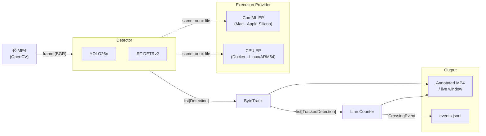

# AegisVision

> Real-time edge computer vision for traffic monitoring — YOLO26 vs RT-DETRv2, CoreML-accelerated on Apple Silicon, containerised for Linux/ARM64.


## Overview

AegisVision is a portfolio-grade traffic monitoring system that detects, tracks, and counts vehicles in a video stream. It benchmarks two detector architectures (YOLO26n CNN vs RT-DETRv2 Transformer) head-to-head across three inference backends (PyTorch/MPS, ONNX + CoreML EP, ONNX + CPU EP), achieves sustained 40+ FPS on an M1 Max at 1080p, and ships as a portable Linux/ARM64 Docker container that runs the same ONNX model file with only the execution provider swapped.

## Architecture



The pipeline, tracker, counter, overlay, and logger are identical across both deployment surfaces. Only the ONNX Runtime execution provider changes: `CoreMLExecutionProvider` dispatches to Apple's CoreML stack (GPU + ANE) on Mac; `CPUExecutionProvider` runs inside a portable Linux container.

## Benchmark Results

Hardware: M1 Max (32-core GPU, 64 GB unified memory). 300 frames at 1080p. Full methodology in [`results/benchmark.md`](results/benchmark.md).

| Model | Backend | imgsz | FPS mean | p50 | p95 | Latency (ms) | F1 vs PT |
| --- | --- | ---: | ---: | ---: | ---: | ---: | :---: |
| yolo | pytorch/mps | 640 | **47.1** | 49.0 | 42.8 | 21.3 | — |
| yolo | onnx/coreml(ALL) | 640 | 46.1 | 45.4 | 43.8 | 21.7 | 0.981 |
| yolo | onnx/cpu | 640 | 32.0 | 32.0 | 30.8 | 31.2 | 0.981 |
| yolo | pytorch/mps | 960 | 45.4 | 48.2 | 42.9 | 22.0 | — |
| yolo | onnx/coreml(ALL) | 960 | 31.1 | 32.1 | 24.5 | 32.2 | 0.931 |
| yolo | onnx/cpu | 960 | 14.1 | 14.0 | 13.5 | 71.1 | 0.933 |
| rtdetr | pytorch/mps | 640 | 22.5 | 22.6 | 20.9 | 44.5 | — |
| rtdetr | onnx/coreml(ALL) | 640 | 6.9 | 6.9 | 6.7 | 144.2 | 0.896 |
| rtdetr | onnx/cpu | 640 | 2.9 | 2.9 | 2.9 | 345.2 | 0.897 |

**Key findings:**

- **CNN vs Transformer is the dominant axis.** YOLO26n clears 30 FPS in every cell at `imgsz=640`; RT-DETRv2 never does.
- **CoreML EP wins for the CNN, loses for the Transformer.** YOLO26n via CoreML EP is within 2% of PyTorch/MPS at 640; RT-DETRv2 via CoreML EP is 3× slower because its graph fragments across many small CoreML subgraphs with CPU glue ops.
- **F1 vs PyTorch baseline ≥ 0.93 for YOLO, ≥ 0.89 for RT-DETR** across all ONNX cells — the export + EP path is behaviourally faithful.
- **Exit criterion met:** ≥ 30 FPS by at least one model × backend at 1080p source.

## Stack

| Layer | Choice |
| --- | --- |
| Language | Python 3.12+ |
| Package manager | `uv` |
| Detection | Ultralytics (YOLO26n, RT-DETRv2) |
| Tracking | ByteTrack (via Ultralytics) |
| Vision I/O | OpenCV |
| Inference runtime | ONNX Runtime (CoreML EP on Mac, CPU EP in Docker) |
| Containerisation | Docker (`linux/arm64`) |
| Logging | Line-delimited JSON (`logs/events.jsonl`) |

## How to Reproduce

**Requirements:** Python 3.12+, `uv`, and a Mac with Apple Silicon (for the native path). Docker Desktop with `linux/arm64` support for the container path.

### Native (Mac)

```bash
# 1. Install dependencies
make setup

# 2. Download the pinned traffic sample (~90 MB)
make fetch

# 3. Run the live demo (opens a window; press q to quit)
make demo

# 4. Export ONNX weights and run the full benchmark matrix
make export-onnx
make benchmark          # writes results/benchmark.md
```

`make demo` uses the PyTorch/MPS backend by default. To use ONNX + CoreML EP:

```bash
uv run python -m aegisvision.pipeline --backend onnx --provider coreml
```

### Docker (Linux/ARM64)

```bash
# Build the image (~9 GB — includes PyTorch for the uv lockfile)
make docker-build

# Run: mounts data/ and writes annotated MP4 + JSONL log to output/
make docker-run
# output/annotated.mp4  — full annotated video
# output/events.jsonl   — structured event log
```

The container uses `CPUExecutionProvider`; no GPU or CoreML stack required.

### Replay the event log

```bash
make replay   # buckets line-crossing events into a counts time-series (10 s buckets)
```

## Repository Layout

```
AegisVision/
├── src/aegisvision/
│   ├── pipeline.py          # frame loop: capture → detect → track → count → render → log
│   ├── detectors/
│   │   ├── base.py          # Detector protocol + Detection dataclass
│   │   ├── pytorch.py       # Ultralytics PyTorch backend (MPS)
│   │   └── onnx.py          # ONNX Runtime backend (CoreML EP / CPU EP)
│   ├── tracker.py           # ByteTrack wrapper
│   ├── counter.py           # line-crossing counter with direction + per-class tallies
│   ├── overlay.py           # OpenCV HUD (boxes, FPS, counts)
│   └── telemetry.py         # JSONL event logger
├── scripts/
│   ├── fetch_sample.py      # yt-dlp download + SHA-256 verify
│   ├── export_onnx.py       # export YOLO + RT-DETR to .onnx
│   ├── benchmark.py         # full model × backend benchmark matrix
│   └── replay_log.py        # replay events.jsonl into a count time-series
├── configs/
│   └── counting_line.yaml   # polyline coordinates + direction labels
├── results/
│   ├── benchmark.md         # generated benchmark table (committed)
│   └── demo.gif             # demo GIF (committed)
├── Dockerfile               # linux/arm64, ONNX + CPU EP
├── Makefile                 # setup / fetch / demo / benchmark / docker-*
└── data/README.md           # sample video URL + SHA-256 + license note
```
